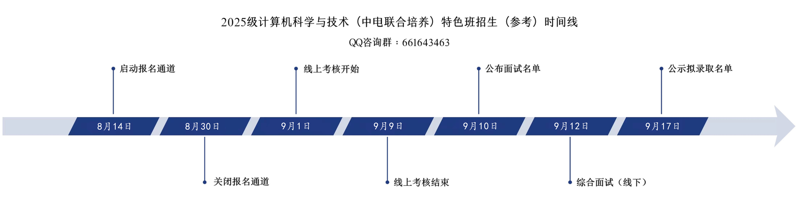

# 报名注意事项（必看）

- 相关报名、考核、面试等信息将在[QQ咨询群](/registration)（群号：661643463）内发布。
- 报名通知现已发布，[计算机学院官网通知](https://www.hziee.edu.cn/jsj/2025/0812/c509a29121/page.htm)，[报名链接](https://www.wjx.cn/vm/tUH4shV.aspx)
- 本班控制人数为40人以内，转入后学费按计算机类收取（每学年27750元），先按照原专业缴费，多退少补
- 通过考核并被录取以后，转入为计算机学院，专业全名：计算机科学与技术（中电联合培养），进入中电班以后相当于用掉了转专业机会，后续不能再转专业，并且已经录取不得退出
- 考核内容：10道程序设计题目，HTML+CSS(+JS)网页设计，计算机基础知识题
- 实习与工作均不做强制，只是为你提供机会，也可以选择考研或其他企业
- 招生对象：2024级普通本科专业（艺术类等学院规定不能转专业的新生除外）
- 考核时间：9月1日-9月9日，具体请等待 [计算机学院官网](https://www.hziee.edu.cn/jsj/) 报名通知和[QQ咨询群](/registration)同步通知

​	

## 报名参考时间线

